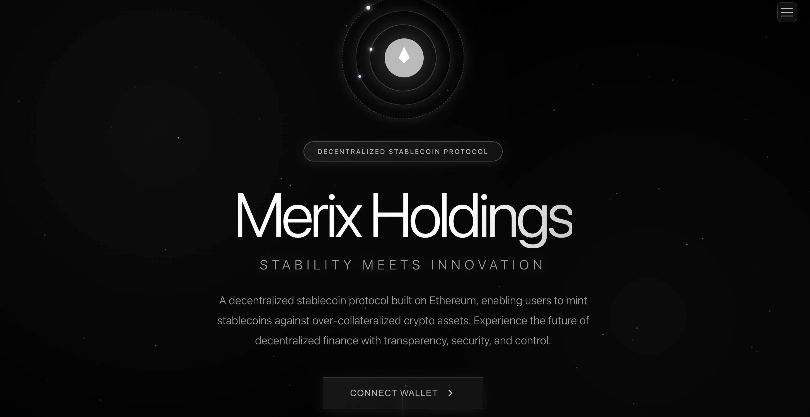
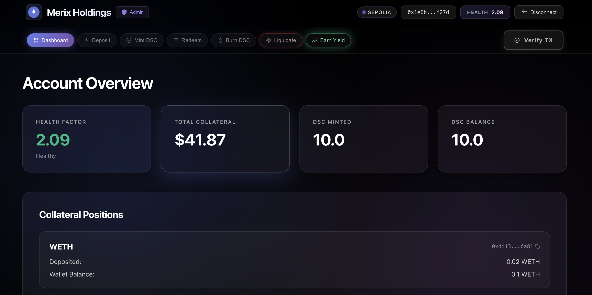
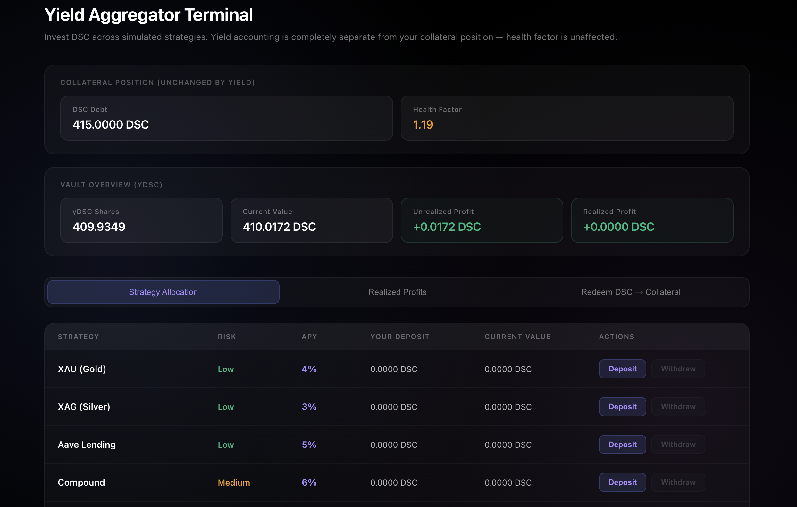
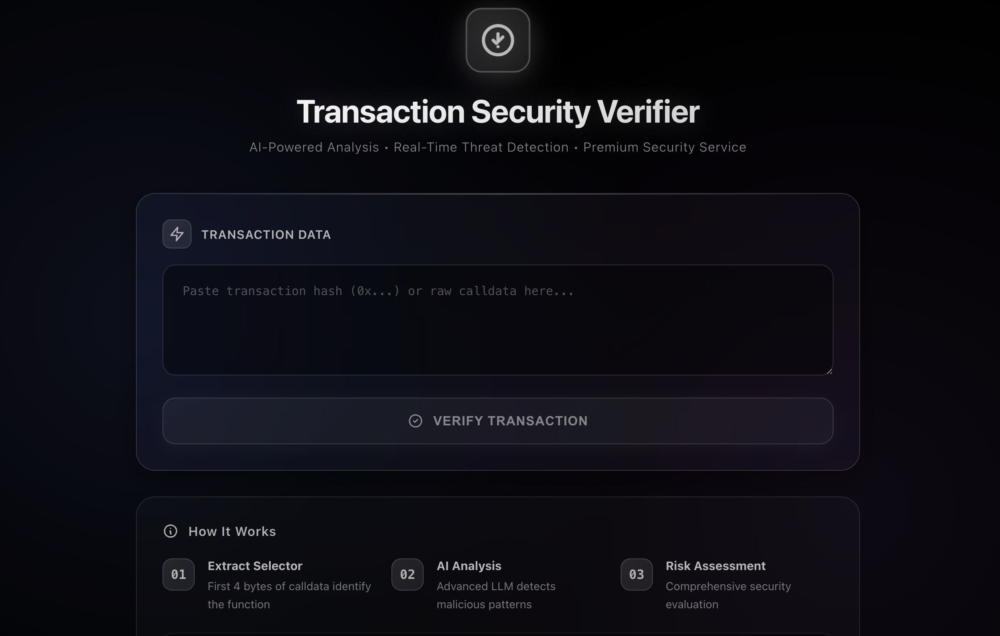

<div align="center">



<br/><br/>


### A decentralized, over-collateralized stablecoin protocol built on Ethereum.
Mint DSC pegged to $1.00 by locking WETH or WBTC — fully on-chain, governed by math, not humans.

**[Live on Sepolia](#deployed-contracts) · [GitHub](https://github.com/Ra9huvansh/Merix-Holdings) · [Twitter](https://x.com/Raghuvansh95)**

</div>

---

## What is Merix Holdings?

Merix Holdings is a **collateral-backed stablecoin protocol** inspired by MakerDAO's DSS system, with zero governance and zero fees. Users deposit blue-chip crypto assets (WETH / WBTC) as collateral and mint **DSC** — a token designed to maintain a $1.00 peg at all times.

The protocol is entirely enforced by smart contracts. No admin can mint DSC out of thin air. No multisig can freeze your collateral. Stability is maintained through over-collateralization, real-time Chainlink price feeds, and a permissionless liquidation mechanism.

On top of the core protocol sits a **Yield Aggregator** — an ERC4626-style vault that lets users put their minted DSC to work across multiple strategies without touching their collateral position or health factor.

---

## Screenshots

<table>
  <tr>
    <td align="center"><b>Dashboard</b></td>
    <td align="center"><b>Yield Aggregator Terminal</b></td>
  </tr>
  <tr>
    <td></td>
    <td></td>
  </tr>
  <tr>
    <td align="center" colspan="2"><b>AI Transaction Security Verifier</b></td>
  </tr>
  <tr>
    <td colspan="2" align="center"></td>
  </tr>
</table>

---

## Protocol Architecture

```
┌─────────────────────────────────────────────────────────────────┐
│                        User (MetaMask)                          │
└──────────────────────────────┬──────────────────────────────────┘
                               │
              ┌────────────────▼────────────────┐
              │           DSCEngine             │
              │   ┌──────────────────────────┐  │
              │   │  depositCollateral()     │  │
              │   │  mintDsc()               │  │
              │   │  redeemCollateral()      │  │
              │   │  burnDsc()               │  │
              │   │  liquidate()             │  │
              │   │  getHealthFactor()       │  │
              │   └──────────────────────────┘  │
              │                                 │
              │  ┌─────────┐   ┌──────────────┐ │
              │  │ WETH    │   │ WBTC         │ │
              │  │Collateral│  │Collateral    │ │
              │  └────┬────┘   └──────┬───────┘ │
              └───────┼───────────────┼─────────┘
                      │               │
              ┌───────▼───────────────▼──────────┐
              │      Chainlink Price Feeds       │
              │   ETH/USD          BTC/USD       │
              └──────────────────────────────────┘
                               │
              ┌────────────────▼────────────────┐
              │    DecentralizedStableCoin (DSC)│
              │      ERC20 · Burnable · Ownable │
              └────────────────┬────────────────┘
                               │
              ┌────────────────▼────────────────┐
              │         YieldAggregator         │
              │   ERC4626-style vault (yDSC)    │
              │   XAU · XAG · Aave · Compound   │
              └─────────────────────────────────┘
```

---

## Smart Contracts

### `DecentralizedStableCoin.sol`

ERC20 token that represents the stablecoin (DSC). Fully owned and controlled by `DSCEngine` — only the engine can mint or burn. Users can burn their own DSC to reduce debt.

### `DSCEngine.sol`

The core of the protocol. Handles all collateral management and DSC lifecycle.

| Function | Description |
|---|---|
| `depositCollateral(token, amount)` | Lock WETH or WBTC into the protocol |
| `mintDsc(amount)` | Mint DSC against deposited collateral |
| `redeemCollateral(token, amount)` | Withdraw collateral (health factor check enforced) |
| `burnDsc(amount)` | Burn DSC to reduce debt and improve health factor |
| `liquidate(token, user, debtToCover)` | Liquidate an undercollateralized position and earn a 10% bonus |
| `getHealthFactor(user)` | Returns the user's current health factor (1e18 = 1.0) |
| `getAccountCollateralValue(user)` | Total collateral value in USD |
| `getAccountInformation(user)` | Returns total DSC minted + collateral value |

**Security:** `ReentrancyGuard` on all state-changing functions, health factor checked before every mint/redeem, strict allowlist for collateral tokens, Chainlink staleness validation via `OracleLib`.

### `OracleLib.sol`

Wrapper around Chainlink `AggregatorV3Interface` that adds staleness checks. If a price feed hasn't updated within the timeout window, the entire protocol pauses to prevent stale-price exploits.

### `YieldAggregator.sol`

An ERC4626-style vault that accepts DSC and issues `yDSC` shares across 5 simulated strategies (XAU, XAG, Aave, Compound, Uniswap LP). Yield accrues via `_harvestAll()` on every interaction. Completely isolated from `DSCEngine` — health factor is never affected. When a user withdraws more than their deposited principal, the surplus is recorded as `realizedProfit` and can be converted to WETH collateral via `RedemptionContract`. If residual shares remain after all strategy deposits are cleared, `withdrawRemainingShares()` allows a full exit.

### `RedemptionContract.sol`

Converts realized yield profit DSC into WETH collateral directly inside DSCEngine. Only the caller's `realizedProfit` balance (tracked by `YieldAggregator`) can be redeemed — preventing any user from redeeming more than they earned. DSC is burned permanently and equivalent WETH (priced via live Chainlink oracle) is deposited as collateral, immediately improving health factor.

---

## Project Structure

```
Merix-Holdings/
├── src/
│   ├── DecentralizedStableCoin.sol   # ERC20 stablecoin
│   ├── DSCEngine.sol                  # Core protocol logic
│   ├── libraries/
│   │   └── OracleLib.sol             # Chainlink staleness checks
│   └── yield/
│       ├── YieldAggregator.sol       # ERC4626 yield vault
│       └── RedemptionContract.sol    # DSC → collateral redemption
│
├── script/
│   ├── DeployDSC.s.sol               # Basic deployment
│   ├── HelperConfig.s.sol            # Network configurations & mock feeds
│   └── DeployAndUpdateFrontend.s.sol # Full deploy + env output
│
├── test/
│   ├── unit/                         # Unit tests
│   └── fuzz/                         # Invariant & fuzz tests
│
├── frontend/
│   ├── src/
│   │   ├── components/
│   │   │   ├── Dashboard.jsx
│   │   │   ├── DepositCollateral.jsx
│   │   │   ├── MintDSC.jsx
│   │   │   ├── RedeemCollateral.jsx
│   │   │   ├── BurnDSC.jsx
│   │   │   ├── Liquidation.jsx
│   │   │   ├── YieldTerminal.jsx
│   │   │   ├── TransactionVerifier.jsx
│   │   │   ├── AdminPanel.jsx
│   │   │   └── LandingPage.jsx
│   │   ├── hooks/
│   │   │   ├── useWeb3.js
│   │   │   ├── useDSCEngine.js
│   │   │   └── useYieldAggregator.js
│   │   ├── constants/
│   │   │   ├── addresses.js
│   │   │   └── abis.js
│   │   └── utils/
│   │       ├── formatting.js
│   │       └── network.js
│   └── package.json
│
├── docs/assets/                      # README screenshots
├── broadcast/                        # Foundry deployment artifacts
├── foundry.toml
└── deploy-sepolia.sh
```

---

## Deployed Contracts

**Network: Sepolia Testnet (Chain ID: 11155111)**

| Contract | Address |
|---|---|
| DSCEngine | [`0x71840A969A548454BCcfA08cFd1fc723246E20B8`](https://sepolia.etherscan.io/address/0x71840A969A548454BCcfA08cFd1fc723246E20B8) |
| DecentralizedStableCoin (DSC) | [`0x9893F5C5D5F0cb8a76e9c6c171a86f9144440760`](https://sepolia.etherscan.io/address/0x9893F5C5D5F0cb8a76e9c6c171a86f9144440760) |
| YieldAggregator | [`0x17Bd3ccb92A8eaDB936F4157B17BD871eA64873b`](https://sepolia.etherscan.io/address/0x17Bd3ccb92A8eaDB936F4157B17BD871eA64873b) |
| RedemptionContract | [`0x78D71f2938250bF69392aa69E9346800c262898D`](https://sepolia.etherscan.io/address/0x78D71f2938250bF69392aa69E9346800c262898D) |
| WETH (Sepolia) | [`0xdd13E55209Fd76AfE204dBda4007C227904f0a81`](https://sepolia.etherscan.io/address/0xdd13E55209Fd76AfE204dBda4007C227904f0a81) |
| WBTC (Sepolia) | [`0x8f3Cf7ad23Cd3CaDbD9735AFf958023239c6A063`](https://sepolia.etherscan.io/address/0x8f3Cf7ad23Cd3CaDbD9735AFf958023239c6A063) |

---

## Getting Started

### Prerequisites

- [Foundry](https://book.getfoundry.sh/getting-started/installation) — smart contract toolchain
- [Node.js](https://nodejs.org/) v18+ — frontend
- [MetaMask](https://metamask.io/) — browser wallet, connected to Sepolia

### Install Foundry

```bash
curl -L https://foundry.paradigm.xyz | bash
foundryup
```

### Clone & Install Dependencies

```bash
git clone https://github.com/Ra9huvansh/Merix-Holdings.git
cd Merix-Holdings

# Foundry dependencies
forge install

# Frontend dependencies
cd frontend && npm install && cd ..
```

### Environment Variables

Create `frontend/.env`:

```env
VITE_DSC_ENGINE_ADDRESS=0x71840A969A548454BCcfA08cFd1fc723246E20B8
VITE_DSC_TOKEN_ADDRESS=0x9893F5C5D5F0cb8a76e9c6c171a86f9144440760
VITE_WETH_ADDRESS=0xdd13E55209Fd76AfE204dBda4007C227904f0a81
VITE_WBTC_ADDRESS=0x8f3Cf7ad23Cd3CaDbD9735AFf958023239c6A063
VITE_YIELD_AGGREGATOR_ADDRESS=0x17Bd3ccb92A8eaDB936F4157B17BD871eA64873b
VITE_REDEMPTION_CONTRACT_ADDRESS=0x78D71f2938250bF69392aa69E9346800c262898D
VITE_CHAIN_ID=11155111

# AI Transaction Verifier (optional — one or both)
VITE_OLLAMA_MODEL=qwen2.5:14b         # Local Ollama model
VITE_GROQ_API_KEY=your_groq_key       # Groq cloud fallback
```

> No spaces around `=`. Restart `npm run dev` after editing `.env`.

### Run the Frontend

```bash
cd frontend
npm run dev
```

Open [http://localhost:5173](http://localhost:5173), connect MetaMask on Sepolia, and you're in.

---

## Local Development (Anvil)

```bash
# Terminal 1 — start local chain
anvil

# Terminal 2 — deploy contracts locally
forge script script/DeployAndUpdateFrontend.s.sol:DeployAndUpdateFrontend \
  --rpc-url http://localhost:8545 \
  --broadcast
```

The script prints all addresses in `.env` format — paste them into `frontend/.env`.

### Run Tests

```bash
# All tests
forge test

# With verbosity
forge test -vvv

# Fuzz / invariant tests (128 runs, depth 128 — configured in foundry.toml)
forge test --match-path "test/fuzz/*"
```

---

## Deploy to Sepolia

```bash
export PRIVATE_KEY=your_private_key_without_0x
export SEPOLIA_RPC_URL=https://sepolia.infura.io/v3/YOUR_KEY
export ETHERSCAN_API_KEY=your_etherscan_api_key

./deploy-sepolia.sh
```

---

## Protocol Mechanics

### Health Factor

The health factor is the single number that determines whether a position is safe.

```
Health Factor = (Total Collateral Value USD × Liquidation Threshold) / Total DSC Minted

Liquidation Threshold = 50%  →  collateral must be 2× the DSC debt
Minimum Health Factor = 1.0  →  below this, position can be liquidated
```

| Health Factor | Status |
|---|---|
| > 2.0 | Safe — well collateralized |
| 1.0 – 2.0 | Caution — monitor your position |
| < 1.0 | Liquidatable |

### Liquidation

When a user's health factor drops below `1.0`, anyone can call `liquidate()`. The liquidator repays some or all of the user's DSC debt and receives the equivalent collateral value **plus a 10% bonus**. This incentivizes external actors to keep the protocol solvent at all times.

### Yield Aggregator

The `YieldAggregator` is a separate contract that accepts DSC and mints `yDSC` shares (ERC4626-style). Share price increases over time as simulated yield accrues. It is architecturally isolated from `DSCEngine` — depositing into the vault does **not** affect collateral, DSC debt, or health factor.

Available strategies:

| Strategy | Risk | APY |
|---|---|---|
| XAU (Gold) | Low | 4% |
| XAG (Silver) | Low | 3% |
| Aave Lending | Low | 5% |
| Compound | Medium | 6% |

### AI Transaction Security Verifier

Before signing any unknown transaction in MetaMask, paste the calldata into the **Verify TX** tab. The verifier:

1. Extracts the 4-byte function selector
2. Resolves it against the local protocol ABI, then [4byte.directory](https://www.4byte.directory/)
3. Sends the full calldata to an LLM (local Ollama first, Groq as cloud fallback) for risk analysis
4. Returns a risk rating: **Safe / Low / Medium / High / Critical**

Runs fully locally with Ollama — no data sent to external servers unless Groq fallback is triggered.

---

## Tech Stack

| Layer | Technology |
|---|---|
| Smart Contracts | Solidity 0.8.18, Foundry, OpenZeppelin, Chainlink |
| Testing | Forge unit tests, fuzz tests, invariant tests |
| Frontend | React 18, Vite 5, ethers.js v6 |
| Wallet | MetaMask (EIP-1193) |
| Market Data | CoinGecko API |
| AI Verifier | Ollama (local LLM) + Groq (cloud fallback) |
| Network | Ethereum Sepolia Testnet |

---

## Authors

**Raghuvansh Rastogi** — Protocol design, smart contracts, frontend
**Ashutosh Tandon** — Smart contract co-author
**Praveen Kumar** — Smart contract co-author

---

## License

MIT — see individual source files for specifics.

---

<div align="center">

**Merix Holdings** — Stability Meets Innovation

[GitHub](https://github.com/Ra9huvansh/Merix-Holdings) · [Twitter](https://x.com/Raghuvansh95)

</div>

